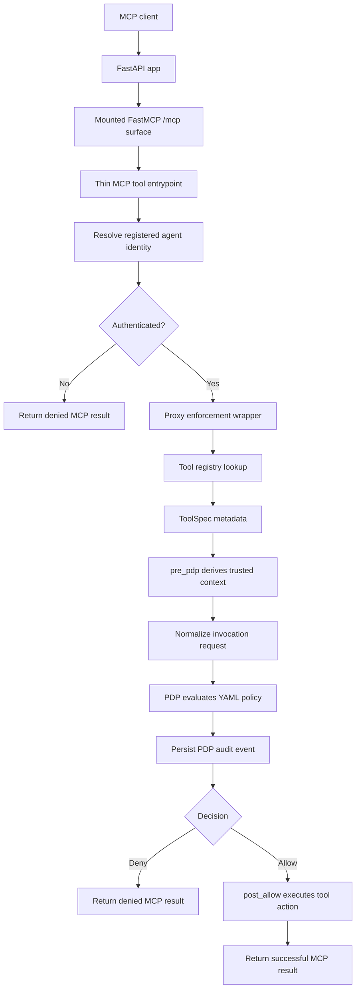
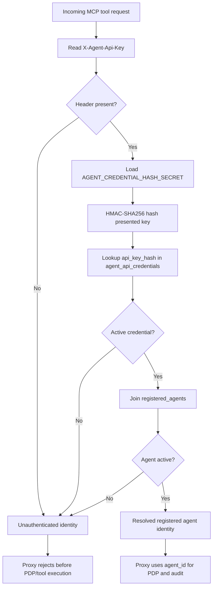

# aws-python-service-platform

Production-style Python/AWS backend portfolio project demonstrating an MCP-facing agent runtime policy enforcement layer.

The service exposes a FastMCP `/mcp` surface, resolves registered agent identity from DB-backed API-key credentials, evaluates tool calls through a deterministic policy decision point (PDP), enforces allow/deny decisions in a proxy layer, persists audit records to PostgreSQL, and runs as a deployed AWS ECS/Fargate vertical slice.

This repository is intended to demonstrate backend/platform engineering depth, not to present a finished SaaS product.

## What this project demonstrates

- Python service development with FastAPI and FastMCP
- MCP tool-call handling through a mounted `/mcp` runtime surface
- proxy / PEP / PDP separation for runtime authorization
- deterministic YAML-backed policy evaluation
- server-derived policy context instead of trusting raw caller arguments
- DB-backed registered-agent identity resolution
- HMAC-SHA256 API-key credential hashing
- PostgreSQL-backed business data and audit persistence
- structured runtime and PDP audit logging
- Docker Compose local development workflow
- AWS deployment with ECR, ECS/Fargate, ALB, RDS PostgreSQL, Secrets Manager, IAM, and CloudWatch
- rerunnable SQL migrations
- one-off ECS operational tasks for RDS migrations and dev credential seeding
- local and AWS MCP smoke-test helpers
- pytest test isolation and GitHub Actions CI

## Project purpose

The core idea is simple:

> An agent runtime should not be allowed to call tools directly without a deterministic control layer deciding whether the action is allowed.

This project implements that control layer around a small document-access example.

Runtime path:

```text
MCP client
-> FastAPI + FastMCP /mcp endpoint
-> thin MCP tool entrypoint
-> registered-agent identity resolution
-> proxy enforcement wrapper
-> trusted pre-PDP context derivation
-> deterministic PDP evaluation
-> allow/deny enforcement
-> PostgreSQL-backed tool action
-> PostgreSQL-backed audit event
```

The implementation is intentionally narrow. It focuses on a complete, auditable enforcement slice rather than broad feature coverage.

## Current stable slice

The current stable slice includes:

- MCP tool call handling
- registered-agent API-key authentication
- proxy normalization
- deterministic PDP evaluation
- PostgreSQL-backed document data
- PostgreSQL-backed PDP audit records
- local Docker Compose runtime
- deployed AWS ECS/RDS/ALB runtime
- allow-path and deny-path MCP smoke tests
- passing local and CI tests

Current MCP tools:

- `list_documents`
- `docs_tool`

Current document example:

- `doc1` is public and allowed
- `doc2` is private and denied by default policy
- every PDP decision is audit-persisted

## Architecture overview



## Runtime contract

The runtime contract is deliberately explicit.

### Tool entrypoints

FastMCP tool functions are thin entrypoints. They receive caller-supplied arguments, resolve caller identity, and pass control to the proxy wrapper.

They do not make policy decisions themselves.

### Proxy / PEP layer

The proxy wrapper acts as the policy enforcement point.

It is responsible for:

- rejecting unauthenticated identities before tool execution
- resolving the registered `ToolSpec`
- deriving trusted decision context before PDP evaluation
- normalizing the request into an internal decision model
- calling the PDP
- persisting audit events
- executing post-allow business logic only after an allow decision
- returning denied MCP results when policy blocks the call

### PDP layer

The PDP evaluates normalized invocation requests against a YAML policy document.

Current semantics:

- rules are evaluated top-to-bottom
- first matching rule wins
- `default_decision` applies if no rule matches
- policy constraints evaluate against trusted `decision_context`
- raw caller-supplied tool arguments are not evaluated directly by the PDP
- rationale codes are returned with decisions
- the loaded policy has a SHA-256 fingerprint for audit traceability

### Trusted decision context

Caller arguments are not automatically policy facts.

For example, `docs_tool(document_id)` receives a caller-supplied `document_id`, but the policy does not trust the caller to state whether that document is public or private.

Instead:

```text
document_id
-> document metadata lookup
-> trusted document_visibility
-> decision_context
-> PDP evaluation
```

That keeps policy decisions based on server-derived facts.

## Registered-agent identity

MCP tool calls require an `X-Agent-Api-Key` header.

Identity resolution flow:



Important properties:

- raw API keys are never stored in PostgreSQL
- presented API keys are HMAC-hashed before lookup
- credentials can be active or revoked
- agents can be active or disabled
- unauthenticated identities are rejected before PDP evaluation, audit persistence, or tool execution
- MCP metadata is not used as an authentication source

The PDP receives the resolved `agent_id`, not credential material.

Credential implementation details such as raw keys, hashes, credential IDs, prefixes, and credential statuses stay outside the PDP.

## Audit model

Every PDP decision is persisted as a database audit event.

The audit record includes:

- request ID
- agent ID
- server name
- tool name
- action/resource
- decision
- rationale
- policy version
- policy SHA-256
- creation timestamp

The database row is the source of truth.

Audit events are also mirrored to stdout through a dedicated `pdp_audit` logger, allowing the same event stream to be captured by CloudWatch in AWS.

## Database and migrations

The project uses PostgreSQL locally and in AWS.

Current migration chain:

```text
migrations/
├─ 001_create_documents_table.sql
├─ 002_seed_documents.sql
├─ 003_create_pdp_audit_table.sql
└─ 004_create_registered_agent_credentials.sql
```

Current tables:

- `documents`
- `pdp_audit`
- `registered_agents`
- `agent_api_credentials`

Schema decisions:

- `documents` backs the document search/read example
- `pdp_audit` backs decision audit persistence
- `registered_agents` stores stable caller identities
- `agent_api_credentials` stores HMAC-hashed API-key credentials
- `agent_api_credentials.api_key_hash` is unique
- `agent_api_credentials.agent_id` references `registered_agents.agent_id`
- credential and agent status values are constrained

## AWS deployment status

The project has a working AWS deployment vertical slice.

AWS runtime path:

```text
Internet client / MCP smoke client
-> Application Load Balancer
-> ECS Fargate service
-> FastAPI + FastMCP app
-> RDS PostgreSQL
-> PDP audit persistence
-> CloudWatch logs
```

Implemented AWS infrastructure:

- ECR repository for the application image
- ECS Fargate cluster
- ECS task definition and service
- Application Load Balancer
- HTTP listener
- target group registration for ECS tasks
- VPC, public subnets, private app subnets, and private DB subnets
- security groups for ALB, app tasks, and RDS
- private RDS PostgreSQL instance
- RDS-managed database password secret
- manually-created Secrets Manager secret for `AGENT_CREDENTIAL_HASH_SECRET`
- ECS task execution role and task role
- CloudWatch log group
- one-off ECS task path for database migrations
- one-off ECS task path for dev registered-agent credential creation/rotation
- deployed MCP smoke-test helper

AWS runtime configuration:

- ECS task definition supplies:
  - `DB_HOST`
  - `DB_PORT`
  - `DB_NAME`
  - `DB_USER`
- ECS task definition injects:
  - `DB_PASSWORD`
  - `AGENT_CREDENTIAL_HASH_SECRET`
- RDS supplies the PostgreSQL database.
- CloudWatch captures app/runtime logs.
- The application reads the same configuration names locally and in AWS.

Verified AWS smoke tests:

- `GET /health` through ALB returns healthy
- deployed `docs_tool` returns `doc1` successfully
- deployed `docs_tool` denies `doc2` with `DEFAULT_DENY`
- the deployed tool path resolves a DB-backed registered-agent credential through `X-Agent-Api-Key`

Current AWS development limitation:

- ECS app tasks currently run in public subnets with `assignPublicIp=ENABLED`.
- This avoids NAT Gateway or VPC endpoints during the first runnable AWS slice.
- Inbound access remains restricted through security groups:
  - Internet -> ALB on port `80`
  - ALB -> ECS app task on port `8000`
  - ECS app task -> RDS on port `5432`

This is a deliberate development-stage trade-off, not the intended production networking posture.

## Operational helper scripts

AWS helper scripts:

- `scripts/run-aws-migrations-task.ps1`
  - starts a one-off ECS/Fargate task
  - runs `scripts/run_aws_migrations.py`
  - applies SQL migrations against private RDS

- `scripts/register-aws-dev-agent-task.ps1`
  - starts a one-off ECS/Fargate task
  - runs `scripts/register_aws_dev_agent.py`
  - creates or rotates the AWS dev registered-agent credential
  - prints the raw dev API key once to CloudWatch logs

- `scripts/smoke-aws-docs-tool.ps1`
  - performs the MCP initialize/session flow
  - calls deployed `docs_tool`
  - accepts `-DocumentId` so allow and deny paths can be checked

Local helper script:

- `scripts/create-local-agent-credential.py`
  - creates or updates the local dev registered-agent credential in `app_db`
  - prints the local raw API key for manual local MCP calls
  - stores only the HMAC hash in PostgreSQL

Raw dev API keys are smoke-test-only material and must not be committed.

## Local development

### Start local PostgreSQL

```powershell
docker compose up -d
```

### Configure local environment

Create `.env` from `.env.example`.

Expected local values:

```text
DB_HOST=localhost
DB_PORT=5432
DB_NAME=app_db
DB_USER=app_user
DB_PASSWORD=app_password
TEST_DB_NAME=test_db
AGENT_CREDENTIAL_HASH_SECRET=local-dev-agent-credential-hash-secret
```

`.env` is local-only.

`.env.example` is the committed template.

### Run local migrations

```powershell
.\scripts\run-migrations.ps1
```

### Create local dev agent credential

```powershell
python scripts/create-local-agent-credential.py
```

This creates or updates the local registered-agent credential in `app_db`.

The script stores only the HMAC-SHA256 hash in PostgreSQL.

## Testing and CI

The test suite covers:

- policy loading and validation
- policy evaluation
- invocation normalization
- tool registry lookup
- negative tool registry lookup
- MCP allow path
- MCP deny path
- MCP downstream failure path
- PDP audit repository/service persistence
- policy SHA-256 audit persistence
- test DB isolation
- typed document decision context validation
- DB-backed API-key identity resolution
- API-key hashing determinism
- active/revoked credential behaviour
- active/disabled registered-agent behaviour
- unauthenticated identity rejection before PDP/tool execution
- API-key-resolved agent identity persisted in audit rows

Important testing distinction:

- direct wrapper/unit tests may use `pytest.raises(...)`
- MCP integration tests assert on returned MCP protocol payloads
- the outer MCP layer converts internal exceptions into protocol-shaped responses

GitHub Actions runs linting and tests on push/PR.

CI currently runs:

```powershell
python -m ruff check .
python -m pytest -m unit
python -m pytest -m integration
```

## Repository structure

Representative structure:

```text
aws-python-service-platform/
├─ app/
│  ├─ main.py
│  ├─ api/
│  ├─ audit/
│  ├─ auth/
│  ├─ core/
│  ├─ db/
│  ├─ policy/
│  ├─ proxy/
│  └─ schemas/
├─ docs/
├─ infra/
│  └─ terraform/
├─ migrations/
├─ scripts/
│  ├─ create-local-agent-credential.py
│  ├─ register-aws-dev-agent-task.ps1
│  ├─ register_aws_dev_agent.py
│  ├─ run-aws-migrations-task.ps1
│  ├─ run_aws_migrations.py
│  └─ smoke-aws-docs-tool.ps1
├─ tests/
├─ Dockerfile
├─ docker-compose.yml
├─ pyproject.toml
├─ .env.example
└─ README.md
```

Separation of concerns:

- `app/main.py` — FastAPI/FastMCP application boundary
- `app/auth/` — credential hashing and credential lookup
- `app/proxy/identity.py` — resolved identity model
- `app/policy/` — policy loading, validation, and evaluation
- `app/proxy/wrapper.py` — proxy orchestration / enforcement
- `app/proxy/normalizer.py` — internal invocation normalization
- `app/proxy/tool_registry.py` — tool metadata registry
- `app/proxy/document_repository.py` — document data access
- `app/audit/` — PDP audit persistence
- `app/db/connection.py` — database connection boundary
- `app/core/config.py` — runtime configuration boundary
- `migrations/` — SQL schema and seed migrations
- `infra/terraform/` — AWS infrastructure definition
- `tests/` — unit and integration tests

## Current endpoints and surfaces

- `GET /health` — operational health check
- `GET /api/v1/service-info` — basic service metadata
- `/mcp/` — mounted FastMCP surface

Current MCP tools:

- `list_documents`
- `docs_tool`

## Boundaries

This project is intentionally focused.

It is not currently trying to be:

- a custom MCP framework implementation
- a multi-service system
- a Kubernetes-first project
- a full SaaS product
- a complex multi-tenant platform
- a feature-heavy end-user application
- a general AI governance platform
- production credential brokerage
- IdP integration
- database-backed policy authoring/storage
- production credential registry UI
- production-grade AWS networking hardening

The emphasis is on doing a smaller set of backend/platform concerns properly:

- FastMCP boundary usage
- proxy / PDP separation
- trustworthy policy inputs
- deterministic policy decisions
- explicit tool contracts
- DB-backed identity resolution
- persistence
- auditability
- structured runtime logging
- containerized local development
- AWS deployment fundamentals
- CI discipline

## Engineering roadmap

Planned hardening should remain tied to production-relevant gaps.

Credible next improvements include:

- immutable image tags instead of deploying `latest`
- HTTPS listener with ACM certificate
- optional HTTP-to-HTTPS redirect
- private ECS task networking without public task IPs
- NAT Gateway or VPC endpoints for outbound AWS service access
- Terraform remote state backend
- migration version tracking
- production-grade registered-agent credential registration and rotation workflow
- CI/CD deployment workflow
- role-based Terraform access using IAM Identity Center / SSO temporary credentials
- GitHub Actions OIDC deployment role for ECS application delivery
- clearer operator documentation for AWS runbooks

The project intentionally favours a small, complete, auditable runtime slice over broad framework expansion.

## Status

This repository is in active build-out as a portfolio project focused on backend/platform depth and MCP-adjacent agent runtime control.

Current status:

- local Docker/PostgreSQL path works
- local and CI tests pass
- AWS ECS/RDS/ALB deployment path works
- AWS RDS migrations run through one-off ECS tasks
- AWS dev registered-agent credential seeding/rotation works
- deployed MCP allow and deny paths have been smoke-tested
- IAM Identity Center admin access is configured for normal AWS console work
