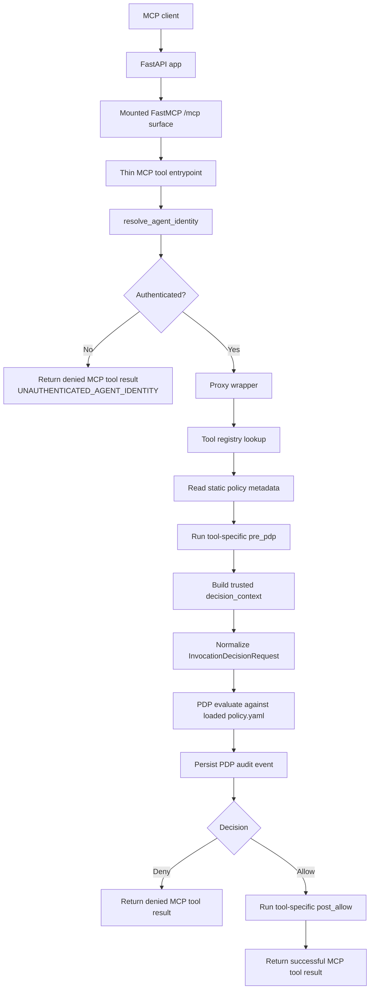
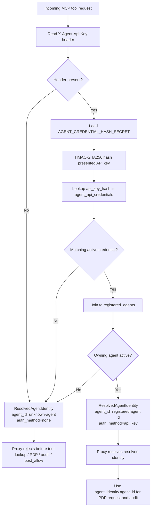
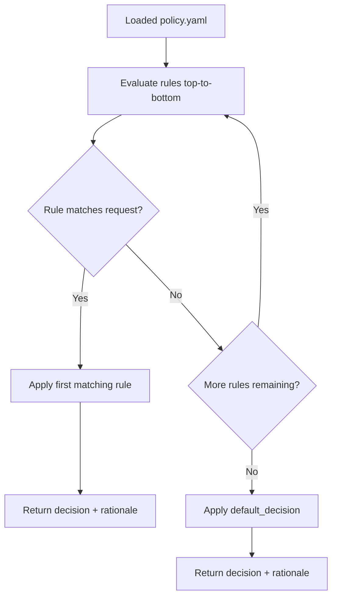
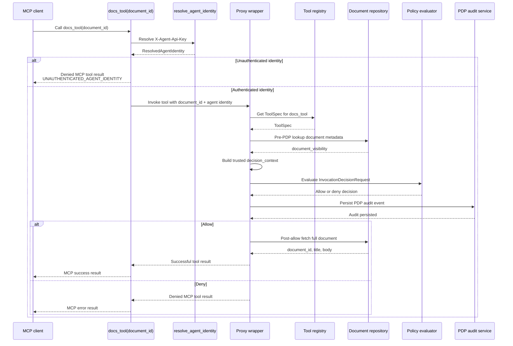
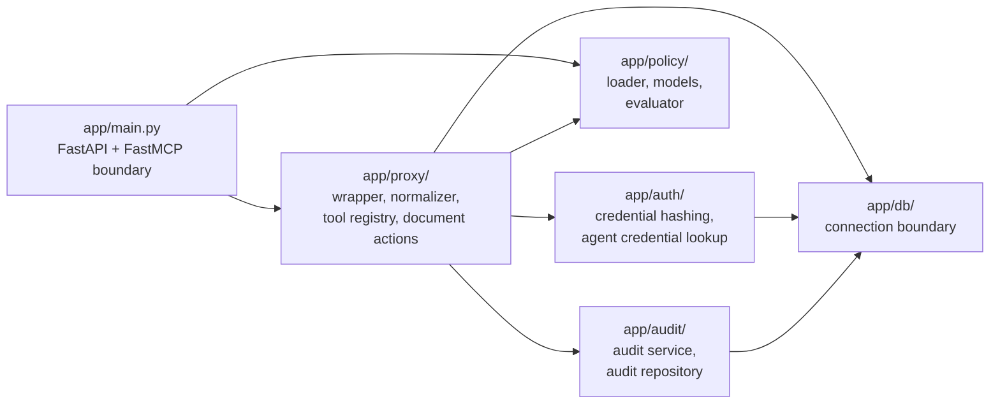

# aws-python-service-platform

Production-style Python backend service portfolio project demonstrating an MCP-facing AI agent runtime policy decision point (PDP), proxy-style enforcement surface, PostgreSQL-backed persistence, registered-agent identity resolution, and audit logging.

The project is intended to show practical backend/platform engineering capability relevant to Python, AWS-oriented service development, and emerging agent-runtime control-plane work.

It demonstrates:

- Python service development with FastAPI
- mounted FastMCP `/mcp` runtime surface
- typed request/response and schema validation
- deterministic policy evaluation
- proxy / PEP / PDP separation
- explicit tool contract boundaries
- DB-backed registered-agent credential lookup
- HMAC-hashed API-key authentication
- PostgreSQL-backed persistence
- structured audit logging
- local Docker Compose development workflow
- rerunnable SQL migrations
- test DB isolation
- GitHub Actions CI

This is not intended as a product launch.

It is intended as evidence of implementation capability.

## Purpose

The core application direction is an MCP-facing agent runtime control surface.

The runtime path is:

- a remote MCP client calls the mounted `/mcp` endpoint
- FastMCP handles the raw MCP / JSON-RPC boundary
- thin tool entrypoints resolve caller identity
- thin tool entrypoints hand off to a proxy wrapper
- the proxy normalizes a tool invocation into an internal decision request
- the PDP evaluates the normalized request against human-authored YAML policy
- if allowed, the proxy executes the tool-specific business action
- if denied, the proxy returns a denied MCP tool result
- every PDP decision is persisted as an audit event

The project focuses on a small but complete enforcement slice rather than broad feature coverage.

## Current implemented shape

The current implemented slice includes:

- FastAPI application foundation
- mounted FastMCP `/mcp` surface
- externalized YAML policy loading and validation
- startup-loaded `LoadedPolicy`
- normalized internal invocation decision model
- deterministic allow/deny policy evaluation
- proxy wrapper controlling:
  - tool lookup
  - pre-PDP enrichment
  - PDP evaluation
  - post-allow execution
  - denied MCP result handling
  - downstream failure logging
- frozen `ToolSpec` dataclass registry
- PostgreSQL-backed document store
- PostgreSQL-backed PDP audit persistence
- DB-backed registered-agent credential lookup
- HMAC-SHA256 API-key hashing using `AGENT_CREDENTIAL_HASH_SECRET`
- dedicated PDP audit logger
- local Docker Compose PostgreSQL workflow
- rerunnable SQL migration and seed scripts
- test DB isolation
- GitHub Actions CI
- MCP tools for:
  - `list_documents`
  - `docs_tool`

## Runtime contract

The current runtime contract is intentionally narrow and explicit.

The high-level runtime request path is:



### Policy loading

- Policy is loaded at application startup.
- The loaded runtime object is `LoadedPolicy`.
- `LoadedPolicy` contains:
  - `document`
  - `policy_sha256`
- `policy_sha256` is calculated from the loaded YAML policy document.
- MCP/proxy runtime paths receive the loaded policy explicitly.

### Tool registry

- `ToolSpec` is a frozen dataclass.
- `ToolSpec` is not a Pydantic model.
- `pre_pdp` and `post_allow` are real Python callables.
- The tool registry stores `ToolSpec` instances.
- `get_tool_spec()` returns a `ToolSpec`.
- The wrapper uses attribute access on the returned spec.

### Invocation contract

- `resource` is singular throughout the runtime contract.
- `resource` is not a list.
- `rationale` remains `list[str]`.
- MCP tool entrypoints pass caller-supplied values to the proxy as `tool_arguments`.
- `tool_arguments` are used by the proxy for pre-PDP enrichment and post-allow execution.
- The PDP request contains `decision_context`.
- `decision_context` is the server-prepared set of facts the PDP is allowed to evaluate.
- Policy constraints evaluate against `decision_context`.
- The PDP does not evaluate raw caller-supplied tool arguments.

### Agent identity resolution

MCP tool entrypoints resolve caller identity before invoking the proxy.

The identity resolution path is:



Current identity resolution flow:

- The request must provide `X-Agent-Api-Key`.
- The raw API key is never stored.
- The presented API key is HMAC-SHA256 hashed using `AGENT_CREDENTIAL_HASH_SECRET`.
- The resulting hash is looked up against `agent_api_credentials.api_key_hash`.
- The credential must have `status = 'active'`.
- The owning registered agent must have `status = 'active'`.
- If both checks pass, the runtime resolves the registered agent's `agent_id` as the trusted agent identity.
- Missing, invalid, revoked, or disabled credentials resolve to `auth_method="none"`.
- `auth_method="none"` is rejected by the proxy before tool lookup, pre-PDP enrichment, PDP evaluation, PDP audit persistence, or post-allow execution.
- MCP request metadata is not used as an authentication source.

The resolver returns `ResolvedAgentIdentity`, currently containing:

- `agent_id`
- `auth_method`
- optional `tenant_id`
- optional `roles`

The proxy receives the resolved identity object and uses `agent_identity.agent_id` for:

- PDP invocation request `agent_id`
- PDP audit event `agent_id`
- runtime logging where agent identity is needed

Credential implementation details are not passed into the PDP. The PDP does not receive:

- raw API keys
- API-key hashes
- credential IDs
- API-key prefixes
- credential status values

`policy.yaml` authorizes the resolved identity. It may match on `agent_id`, but it should not contain or evaluate credential material.

Additional identity facts such as `roles`, `tenant_id`, or `auth_method` should only be added to `decision_context` when policy rules actually need to evaluate them.

### Audit contract

- PDP audit persistence writes to the `pdp_audit` table as the source of truth.
- Audit events are also mirrored to stdout through the dedicated `pdp_audit` logger.
- Normal application/runtime logging is separate from audit logging.
- Runtime application events include:
  - `tool_invocation_blocked`
  - `tool_invocation_executed`
  - `tool_invocation_failed`

## Current MCP proxy flow

The current runtime flow is:

1. MCP client calls `/mcp`
2. FastMCP parses and routes the tool invocation
3. Tool entrypoint resolves caller identity from `X-Agent-Api-Key`
4. Tool entrypoint passes `tool_name`, `tool_arguments`, and `ResolvedAgentIdentity` into the proxy wrapper
5. Proxy rejects unauthenticated identity before tool lookup or PDP evaluation
6. Proxy resolves the registered `ToolSpec`
7. Proxy reads static policy metadata from the spec
8. Tool-specific `pre_pdp(...)` derives trusted context where required
9. Proxy normalizes the invocation into `InvocationDecisionRequest`
10. PDP evaluates the request against the loaded YAML policy
11. PDP decision is persisted as a `PDPAuditEvent`
12. On allow, tool-specific `post_allow(...)` business logic runs
13. On deny, the proxy returns a denied MCP tool result
14. If downstream post-allow execution fails, the failure is logged and returned through the MCP error result shape

## Current policy model



Current policy semantics are intentionally simple:

- rules are evaluated top-to-bottom
- first matching rule wins
- `default_decision` applies if nothing matches
- policy constraints evaluate against `decision_context`
- `decision_context` contains server-prepared policy facts
- raw caller-supplied tool arguments are not evaluated directly by the PDP
- decisions are deterministic
- rationale codes are returned as a list of strings

Credential lookup proves identity. `policy.yaml` authorizes the resolved identity.

For the current document example:

- `list_documents(query)` receives caller input as a tool argument
- `docs_tool(document_id)` receives caller input as a tool argument
- the proxy uses tool arguments to perform any required pre-PDP enrichment
- trusted `document_visibility` is derived from the document repository
- trusted `document_visibility` is supplied to the PDP in `decision_context`
- policy decides using the normalized invocation request, not raw MCP JSON

## Current document example



The current document flow is deliberately small but end-to-end:

- `list_documents(query)` searches title/summary over PostgreSQL-backed document data
- only public documents are returned in search results
- `docs_tool(document_id)` derives trusted visibility metadata before PDP evaluation
- if allowed, the selected document is returned
- if denied, the tool returns an MCP error result shape
- each allow/deny decision writes a PDP audit row

This keeps the enforcement mechanism visible while using a real database-backed flow.

## Audit persistence

PDP decisions are persisted through the audit service/repository layer.

The audit record includes the normalized decision context, including:

- request ID
- agent ID
- server name
- tool name
- invocation action
- resource
- decision
- rationale
- policy version
- policy SHA-256
- creation timestamp

The database row is the source of truth.

The dedicated `pdp_audit` logger mirrors audit events to stdout so the same event stream can later be routed to CloudWatch or another operational sink.

## Database and migrations

The project uses PostgreSQL locally via Docker Compose.

The intended migration chain is:

```text
migrations/
├─ 001_create_documents_table.sql
├─ 002_seed_documents.sql
├─ 003_create_pdp_audit_table.sql
└─ 004_create_registered_agent_credentials.sql
```

Current schema decisions:

- `documents` backs the current document search/read flow
- `pdp_audit` backs PDP audit persistence
- `registered_agents` stores stable registered agent identities
- `agent_api_credentials` stores hashed API-key credentials
- `pdp_audit.resource` is `TEXT NOT NULL`
- `pdp_audit.rationale` is `TEXT[] NOT NULL`
- `pdp_audit.policy_sha256` is included in the base audit migration
- `registered_agents.status` is constrained to `active` or `disabled`
- `agent_api_credentials.status` is constrained to `active` or `revoked`
- `agent_api_credentials.api_key_hash` is unique
- `agent_api_credentials.agent_id` references `registered_agents.agent_id` with `ON DELETE RESTRICT`

Earlier migration churn around `resource` and `policy_sha256` has been folded back into the final intended `003_create_pdp_audit_table.sql` migration.

## Local database setup

### 1. Start PostgreSQL

From the project root:

```powershell
docker compose up -d
```

This starts the local Postgres container defined in `docker-compose.yml`.

### 2. Configure local environment variables

Create a local `.env` file in the project root.

Use `.env.example` as the template:

```text
DB_HOST=localhost
DB_PORT=5432
DB_NAME=app_db
DB_USER=app_user
DB_PASSWORD=app_password
TEST_DB_NAME=test_db
AGENT_CREDENTIAL_HASH_SECRET=local-dev-agent-credential-hash-secret
```

`.env` is used locally at runtime.

`.env.example` is the committed template.

`AGENT_CREDENTIAL_HASH_SECRET` is the server-side HMAC secret used to hash presented agent API keys before lookup against `agent_api_credentials.api_key_hash`.

The raw API key itself is not configured in `.env` and is not stored in PostgreSQL.

### 3. Run database migrations and seed data

From the project root:

```powershell
.\scripts\run-migrations.ps1
```

This applies the local application database migrations.

The app database seed migration is intended for `app_db`.

Test data setup should use the test DB setup path, not the app DB seed path.

Manual MCP calls require an active registered agent and an active credential hash in the application database. Tests seed their own credential data in the isolated test database.

### 4. Verify the document data

```powershell
docker compose exec -T postgres psql -U app_user -d app_db -c "SELECT document_id, title, document_visibility FROM documents;"
```

### 5. Verify registered agent credential data

```powershell
docker compose exec -T postgres psql -U app_user -d app_db -c "SELECT agent_id, display_name, status FROM registered_agents;"
```

```powershell
docker compose exec -T postgres psql -U app_user -d app_db -c "SELECT credential_id, agent_id, api_key_prefix, status, created_at, revoked_at FROM agent_api_credentials;"
```

### 6. Verify PDP audit data

```powershell
docker compose exec -T postgres psql -U app_user -d app_db -c "SELECT request_id, tool_name, resource, decision, rationale, policy_sha256, created_at FROM pdp_audit ORDER BY created_at DESC LIMIT 10;"
```

## Database configuration

Database connection settings are read from environment-based settings in `app/core/config.py`.

This keeps the application boundary aligned with the intended AWS deployment model:

- local development uses `.env`
- test execution uses test DB overrides
- production can later use ECS environment variables / Secrets Manager

Direct DB/repository tests must explicitly include the DB override fixture.

Without that fixture, a direct repository test may hit the wrong database.

## Current repository direction



A representative current structure is:

```text
aws-python-service-platform/
├─ app/
│  ├─ main.py
│  ├─ api/
│  │  ├─ deps.py
│  │  └─ routes.py
│  ├─ audit/
│  │  ├─ pdp_audit_repository.py
│  │  └─ pdp_audit_service.py
│  ├─ auth/
│  │  ├─ __init__.py
│  │  ├─ agent_credentials_repository.py
│  │  └─ credential_hashing.py
│  ├─ core/
│  │  ├─ config.py
│  │  └─ logging.py
│  ├─ db/
│  │  └─ connection.py
│  ├─ policy/
│  │  ├─ evaluator.py
│  │  ├─ loader.py
│  │  └─ models.py
│  ├─ proxy/
│  │  ├─ config.py
│  │  ├─ wrapper.py
│  │  ├─ normalizer.py
│  │  ├─ identity.py
│  │  ├─ tool_spec.py
│  │  ├─ tool_registry.py
│  │  ├─ document_repository.py
│  │  └─ document_actions.py
│  └─ schemas/
│     ├─ invocation.py
│     ├─ pdp_audit.py
│     └─ system.py
├─ docs/
├─ migrations/
├─ scripts/
├─ tests/
├─ Dockerfile
├─ docker-compose.yml
├─ pyproject.toml
├─ .env.example
└─ README.md
```

The intended separation is:

- FastAPI/FastMCP application boundary in `app/main.py`
- API-key credential hashing and lookup in `app/auth/`
- resolved identity boundary in `app/proxy/identity.py`
- policy loading/evaluation in `app/policy/`
- proxy orchestration in `app/proxy/wrapper.py`
- invocation normalization in `app/proxy/normalizer.py`
- tool registry in `app/proxy/tool_registry.py`
- document data access in `app/proxy/document_repository.py`
- post-allow business actions in domain-specific action modules
- database connection boundary in `app/db/connection.py`
- deployment/runtime config boundary in `app/core/config.py`
- SQL migrations in `migrations/`
- marker-based unit and integration tests in `tests/`

## Current endpoints and surfaces

- `GET /health` — operational health check
- `GET /api/v1/service-info` — basic service metadata
- mounted MCP surface at `/mcp`

Current MCP tools:

- `list_documents`
- `docs_tool`

## Testing state

The current test suite covers:

- policy loading
- policy evaluation
- invocation normalization
- tool registry lookup
- negative tool registry lookup
- MCP allow path
- MCP deny path
- MCP downstream failure path
- PDP audit repository/service persistence
- policy SHA-256 audit persistence
- test DB isolation
- typed document decision context validation
- DB-backed API-key identity resolution
- API-key hashing determinism
- API-key hash changes when the API key or HMAC secret changes
- active credential for active registered agent resolves agent identity
- revoked credential does not resolve agent identity
- active credential for disabled registered agent does not resolve agent identity
- unresolved agent identity rejection before PDP/tool execution
- API-key-resolved agent identity persisted in PDP audit rows

Important testing distinction:

- direct wrapper/unit tests may use `pytest.raises(...)` for expected exceptions
- MCP integration tests should assert on returned MCP error payloads
- the outer MCP layer converts internal exceptions into protocol-shaped responses

## CI

GitHub Actions runs linting and tests on push/PR.

CI installs the project with:

```powershell
python -m pip install ".[dev]"
```

The CI path uses a normal project install rather than editable install.

CI currently runs:

```powershell
python -m ruff check .
python -m pytest -m unit
python -m pytest -m integration
```

Editable install is still useful for local development, but it is not the preferred default for this CI workflow.

## Boundaries

This project is intentionally focused.

It is not currently trying to be:

- a custom MCP framework implementation
- a multi-service system
- a Kubernetes-first project
- a full SaaS product
- a complex multi-tenant platform
- a feature-heavy end-user application
- a general AI governance platform
- real credential brokerage
- IdP integration
- database-backed policy authoring/storage

The emphasis is on doing a smaller set of backend/platform concerns properly:

- FastMCP boundary usage
- proxy / PDP separation
- trustworthy policy inputs
- deterministic policy decisions
- explicit tool contracts
- DB-backed identity resolution
- persistence
- auditability
- structured runtime logging
- containerised local development
- CI discipline

## Likely next backend work

The next backend work should remain tied to real contract gaps, not speculative refactoring.

Near-term priorities are:

- keep the README and docs aligned with the implemented runtime
- only add tests where an actual uncovered enforcement or persistence behaviour is identified
- keep the migration chain clean and linear
- avoid introducing new infrastructure until the current direct SQL and proxy/PDP boundaries show a real limitation

The project should continue to favour a small, complete, auditable runtime slice over broader framework expansion.

## Status

This repository is in active build-out as a portfolio project focused on backend/platform depth and MCP-adjacent agent runtime control.

The current stable slice is:

- MCP tool call
- proxy normalization
- DB-backed registered-agent identity resolution
- deterministic PDP decision
- PostgreSQL-backed business data
- PostgreSQL-backed audit record
- structured runtime logging
- passing local and CI tests
