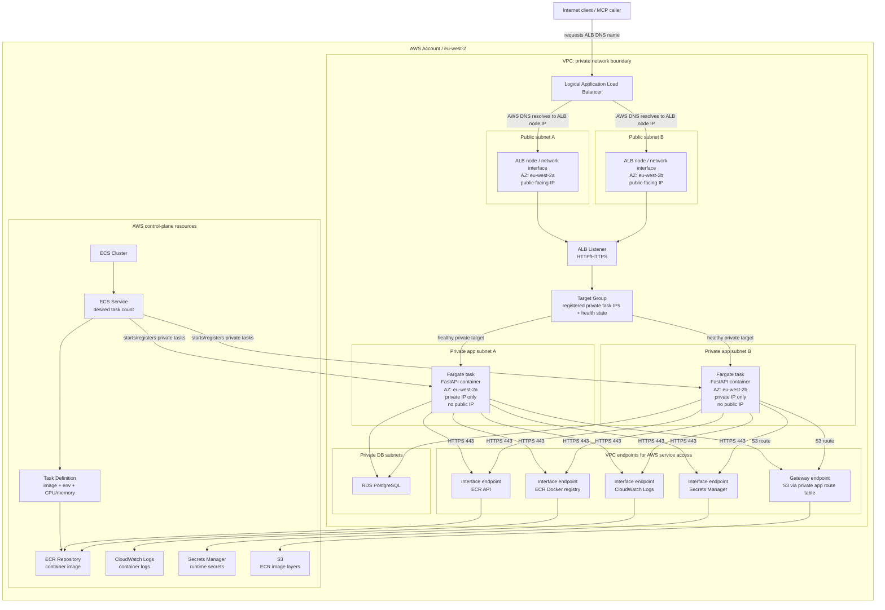

# AWS Deployment Target

## Purpose

Define the implemented AWS runtime shape for `aws-python-service-platform`.

## Target runtime path

```text
Client / MCP caller
  -> Application Load Balancer
  -> ECS Fargate service in private app subnets
  -> FastAPI + FastMCP app
  -> RDS PostgreSQL in private DB subnets
  -> CloudWatch logs via VPC endpoint
```

## AWS services

| Concern | AWS service |
|---|---|
| Container runtime | ECS Fargate |
| HTTP ingress | Application Load Balancer |
| Database | RDS PostgreSQL |
| Secrets | Secrets Manager or SSM Parameter Store |
| Logs | CloudWatch Logs |
| Private AWS service access | VPC endpoints for ECR, CloudWatch Logs, Secrets Manager, and S3 |
| Runtime permissions | ECS task role |
| Infrastructure | Terraform |

## Runtime configuration mapping

The AWS deployment should keep the same application configuration contract used locally, but change where values come from.

| Setting | Local source | AWS source | Notes |
|---|---|---|---|
| `DB_HOST` | `.env` / local Docker Postgres host | Terraform output from RDS endpoint | Changes from `localhost` to the RDS endpoint |
| `DB_PORT` | `.env` | ECS environment variable | Usually remains `5432` |
| `DB_NAME` | `.env` | ECS environment variable | Same logical application database name |
| `DB_USER` | `.env` | ECS environment variable or secret | Database user for RDS PostgreSQL |
| `DB_PASSWORD` | `.env` | Secrets Manager | Injected into the ECS task at runtime |
| `TEST_DB_NAME` | `.env` | Not required for deployed runtime | Used by local/CI test flows |
| `AGENT_CREDENTIAL_HASH_SECRET` | `.env` | Secrets Manager | Used to HMAC-hash presented agent API keys |

The application code should continue reading configuration through the existing settings module. Terraform and ECS are responsible for supplying the correct runtime values.

## Implemented deployment scope

The current AWS deployment runs the existing service using RDS-backed configuration, CloudWatch logging, private ECS task networking, and VPC endpoints for required AWS-service access.

## Deferred scope

Credential brokerage, STS-based tool credentials, S3-backed document reads, admin API, and advanced concurrency testing are deferred until the baseline deployment is working.

## AWS runtime boundary model

